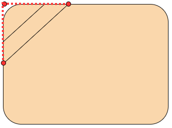
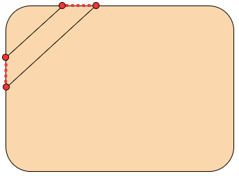

# CornerLayout

给任意布局添加边角横幅，效果如下图：


## 一、引入

```groovy
implementation 'com.hurryyu:cornerlayout:1.0'
```

## 二、使用

只需将您需要添加“边角横幅”的View使用CornerLayout包裹即可，示例代码如下：

```xml
<?xml version="1.0" encoding="utf-8"?>
<LinearLayout xmlns:android="http://schemas.android.com/apk/res/android"
    xmlns:app="http://schemas.android.com/apk/res-auto"
    xmlns:tools="http://schemas.android.com/tools"
    android:orientation="vertical"
    android:layout_width="match_parent"
    android:layout_height="match_parent"
    android:gravity="center"
    tools:context=".MainActivity">

    <com.hurryyu.cornerlayout.CornerLayout
        android:id="@+id/cornerLayout"
        android:layout_width="wrap_content"
        android:layout_height="wrap_content"
        app:bannerBackgroundColor="@color/colorPrimary"
        app:bannerDistanceLength="75dp"
        app:bannerText="限时6折"
        app:bannerTextColor="#FFFFFF"
        app:bannerTextSize="14sp"
        app:bannerWidth="34dp">

        <TextView
            android:layout_width="180dp"
            android:layout_height="130dp"
            android:background="@drawable/shape_book_card"
            android:gravity="center"
            android:text="安徒生童话"
            android:textColor="#FFFFFF"
            android:textSize="22sp"
            android:textStyle="bold" />
    </com.hurryyu.cornerlayout.CornerLayout>

</LinearLayout>
```

其中您可以自行修改的属性如下：

|        属性名         |                        作用                        |
| :-------------------: | :------------------------------------------------: |
| bannerBackgroundColor |                 设置横幅的背景颜色                 |
| bannerDistanceLength  | 设置横幅在View的长度和宽度上的最远距离(见下图解释) |
|      bannerWidth      |             设置横幅的宽度(见下图解释)             |
|    bannerTextColor    |                  横幅上文字的颜色                  |
|    bannerTextSize     |                  横幅上文字的大小                  |
|      bannerText       |                  横幅上的文字内容                  |

下面对两个比较难理解的属性做出解释：

- bannerDistanceLength（设置横幅在View的长度和宽度上的最远距离）

  

- bannerWidth（设置横幅的宽度）

  

## 三、实现过程

我精心编写了一篇文章《Android自定义View实战-边角横幅》，它讲解了这个自定义View的实现过程，如果您对此感兴趣，可前往阅读文章了解详情。

博客：[HurryYu的博客](https://www.hurryyu.com/2020/09/04/Android%E8%87%AA%E5%AE%9A%E4%B9%89View%E5%AE%9E%E6%88%98-%E8%BE%B9%E8%A7%92%E6%A8%AA%E5%B9%85/)

CSDN：[HurryYu的CSDN](https://blog.csdn.net/cqbbyzh/article/details/108408490)

简书：[HurryYu的简书](https://www.jianshu.com/p/53989dc3b6cd)

如果对您有帮助，欢迎star，谢谢~